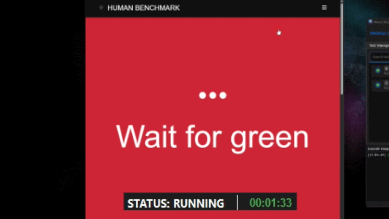
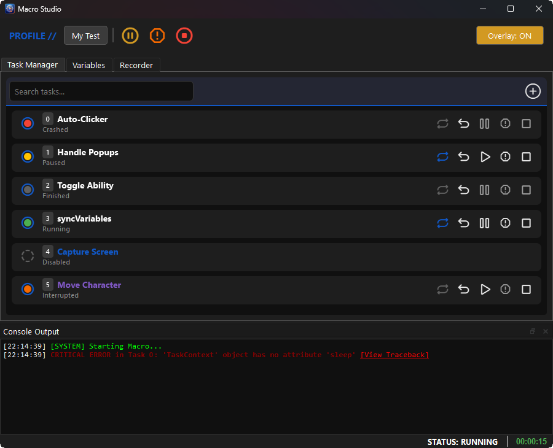

<div align="center" style="margin: 4rem 0;">
  <h1 style="font-weight: 800; font-size: 2.5rem; margin-bottom: 1rem;">Limitless automation, powered by Python.</h1>
  <p style="font-size: 1.2rem; max-width: 700px; margin: 0 auto 2rem auto; color: var(--md-default-fg-color--light);">
    A high-performance desktop automation framework that bridges the gap between simple recorders and complex software development.
  </p>
  <a href="api_engine/" class="md-button md-button--primary">Get Started</a>
  <a href="https://github.com/theeman05/MacroStudio" class="md-button">View on GitHub</a>
</div>

---

<div class="grid cards" markdown>

-   :material-rocket-launch:{ .lg .middle } __Professional Power__
    ---
    Script logic in pure Python with access to OpenCV, API requests, and full OS interaction.

-   :material-shimmer:{ .lg .middle } __Sleek GUI__
    ---
    Manage task lifecycles, variables, and profiles through a user-friendly interface.

-   :material-bridge:{ .lg .middle } __The Bridge__
    ---
    The best of both worlds: the ease of a recorder with the limitless potential of a Saturn V rocket.

</div>

---

## :material-rocket-launch: Quick Start

### Option 1: Install via pip (Recommended)
```bash
pip install macro-studio


```

### Option 2: Standalone Executable (Windows)

If you prefer not to use Python environments, you can download the latest pre-compiled `.exe` from the [GitHub Releases page](https://github.com/theeman05/MacroStudio/releases).

!!! warning "Tesseract OCR Required"
    If you plan to use `vision.captureScreenText()` in your macros to read text from the screen, you **must** install the Tesseract C++ binary separately. See the [Vision API](api_vision.md) page for installation details.

---

## :material-television-play: See it in Action

Check out the engine showcase, or the short demo reacting to the Human Benchmark in real-time.

??? info "View Performance Demo (GIF)"
    <p align="center">
      
      <br>
      <em>Macro Studio achieving a 17ms average on the Human Benchmark website.</em>
    </p>

!!! info "See the Full Showcase"
    <p align="center">
        :material-hand-pointing-right: **[Watch the Showcase on YouTube](https://youtu.be/p550JDNzMPk)** :material-hand-pointing-left:
    </p>

---

## Core Features

### :material-infinity: Infinite Possibilities
Other macro recorders give you a tricycle; we are handing you the keys to a Saturn V rocket. If you can code it in Python, you can automate it. Import any library, use complex logic, and interact with the OS at a deep level. You are not limited to "click here, wait 5 seconds." If you want your macro to query a database, hit a REST API, and then click the button, go for it.

### :material-tune: Visual Task Manager



The central orchestration hub of the studio. It provides a real-time, graphical interface for monitoring and controlling the execution flow of both coded Python tasks and manually recorded macros.

### :material-folder-open: Profile & Variable Management


Define variables (Integers, Booleans, Regions, Points, etc.) that are exposed directly in the GUI. Users can tweak settings safely via the interface without ever touching your code. Values are saved per-profile, allowing you to maintain different configurations for different environments.

The engine currently supports complex types like ``QRect`` (Regions), ``QPoint`` (Coordinates), and ``QColor`` (Colors) with visual screen overlays. This ensures users don't have to manually define these, but they still can if they enjoy the suffering!

### :material-camcorder: Visual Task Recorder (No-Code)


For the days you just don't feel like typing. Record your mouse and keyboard actions with zero coding required. You can even export your recorded sequences directly to a standalone Python script to wrap them in custom logic—it's the perfect way to learn the engine's API, or just save yourself 10 minutes of typing!

---

## :material-book-open-page-variant: Documentation Directory

Ready to start building? Dive into the official documentation to learn how to harness the full power of Macro Studio:

* :material-cog: **[Engine API](api_engine.md)** - Learn how to initialize the studio, add basic tasks, and run threaded operations.
* :material-controller-classic: **[Task Controllers](api_controllers.md)** - Master the control flow of your macros by safely pausing, resuming, and stopping tasks.
* :material-mouse: **[Actions Library](api_actions.md)** - Explore the built-in, thread-safe mouse and keyboard simulators.
* :material-eye: **[Vision Library](api_vision.md)** - Give your macros sight with OpenCV and Tesseract OCR integration.
* :material-dna: **[Registries](api_registries.md)** - Learn how to inject custom types into the engine's UI.
* :material-lightbulb-on: **[Examples](examples/basic_class.md)** - View fully runnable, copy-pasteable scripts to jumpstart your development.

---

## :material-handshake: Contributing & Support

Contributions are welcome! Whether you are fixing bugs, adding new features, or creating example tasks, I would love to see your work :)

If you find this studio helpful and want to support its development, consider buying me a coffee! It helps keep the updates coming.

!!! info "A Mission for Open-Source"
    Macro Studio is, and always will be, 100% free. 
    Curious about the engine's architecture and why I built it? 
    [Read the Philosophy here.](philosophy.md)

<p align="center">
    <a href="https://buymeacoffee.com/dbhs" target="_blank"></a>
</p>